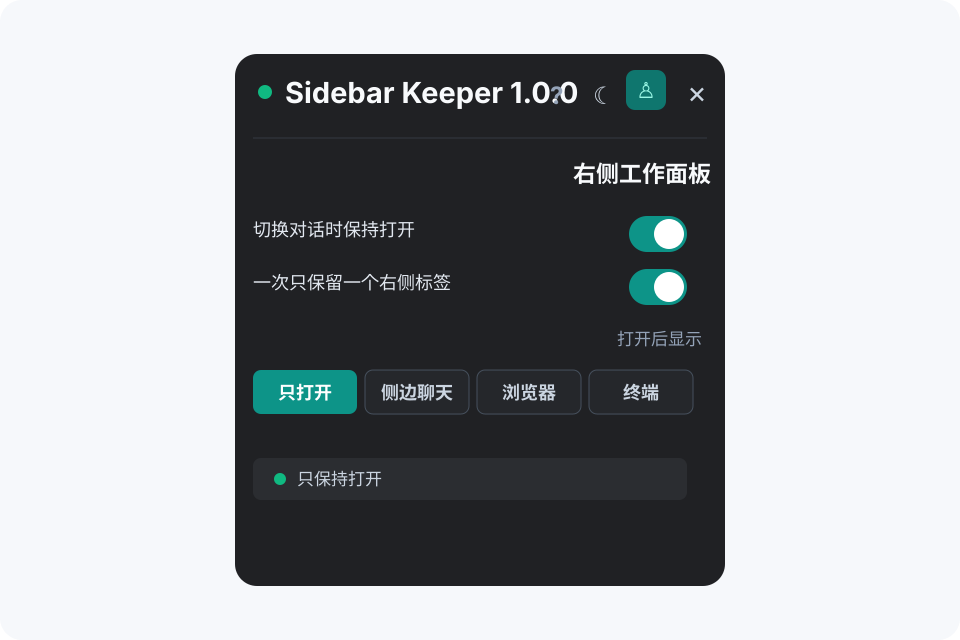
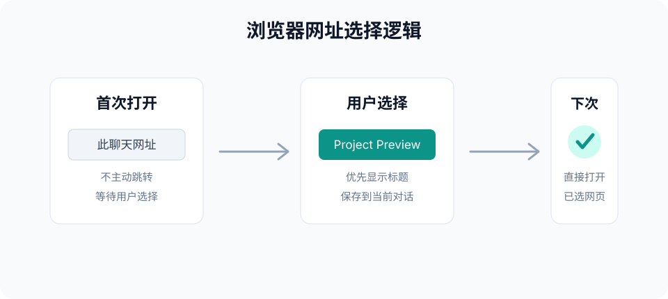

# Codex Sidebar Keeper

Codex Sidebar Keeper 是一个独立的 Codex 个人插件。它会在 Codex Desktop 顶部栏显示 `Sidebar Keeper` 入口，用来保持右侧工作面板，并按你的选择打开侧边聊天、浏览器或终端。


## 界面预览

设置面板保持轻量、深色、可拖动，顶部入口则尽量贴近 Codex 原生顶部栏样式。



浏览器网址会先以 `此聊天网址` 作为首次和兜底选项；用户选择具体网页后，插件会按当前对话记住，并在下次优先打开上次选择的网站。



## 功能

- 切换对话后自动保持 Codex 右侧工作面板打开。
- 支持 `只打开`、`侧边聊天`、`浏览器`、`终端` 四种打开后状态。
- 开启 `切换对话时保持打开` 后默认回到 `只打开`，避免立刻自动切换到工具。
- 关闭 `切换对话时保持打开` 时，侧边聊天、浏览器和终端只显示提示，不会强行打开。
- `一次只保留一个右侧标签` 会关闭多余的右侧标签，并尽量保持当前主对话不被拉走。
- 新建对话时只保持右侧栏状态，不会自动拉回旧对话。
- 浏览器网址下拉框会合并当前对话和已有缓存，优先显示网页标题，拿不到标题时才显示网址。
- 浏览器网址缓存会过滤对话正文、终端提示、错误页标题等误识别内容。
- 支持浅色/深色面板、面板置顶、拖动面板位置和状态提示。

## 使用

打开 Codex Desktop 顶部栏里的 `Sidebar Keeper` 控件。

- `切换对话时保持打开`：Codex 隐藏右侧栏时自动重新打开。关闭时不会自动保持侧边聊天、浏览器或终端。
- `一次只保留一个右侧标签`：只保留当前选择的右侧目标，关闭其它右侧标签。
- `打开后显示`：选择右侧栏打开后要保持的目标；`只打开` 只展开右侧栏。
- `浏览器网址`：选择 `浏览器` 时可选。`此聊天网址` 是首次和兜底选项，不会主动跳转；选择具体网页后会按对话记住。

脚本只在 Codex 主应用界面运行。右侧栏里打开的网页不会触发这个自动化逻辑。

## 安装

插件清单位于：

```text
.codex-plugin/plugin.json
```

插件会暴露 `codex-sidebar-keeper` skill，并附带用于本地验证和备用热键的脚本。

## 开发与检查

校验插件清单：

```powershell
python <path-to-plugin-creator>\scripts\validate_plugin.py .
```

检查用户脚本语法：

```powershell
node --check .\market\scripts\codex-sidebar-keeper.js
```

通过 CDP 查看当前 Codex 窗口里的脚本状态：

```powershell
.\scripts\Invoke-CodexCdp.ps1 -Port <debug-port> -Expression "window.__codexSidebarKeeper.getState()"
```

## 备用脚本

旧版 Windows 热键辅助脚本仍然保留，作为备用方案：

```powershell
.\scripts\Start-CodexSidebarKeeper.ps1
.\scripts\Stop-CodexSidebarKeeper.ps1
```

这些脚本只在本机运行，不会发送网络请求。

## 隐私

仓库中的示意图是手工绘制的通用界面，不包含真实聊天内容、路径、账户或本机截图。插件状态和浏览器网址缓存都保存在本地浏览器环境中。

## 许可证

MIT
